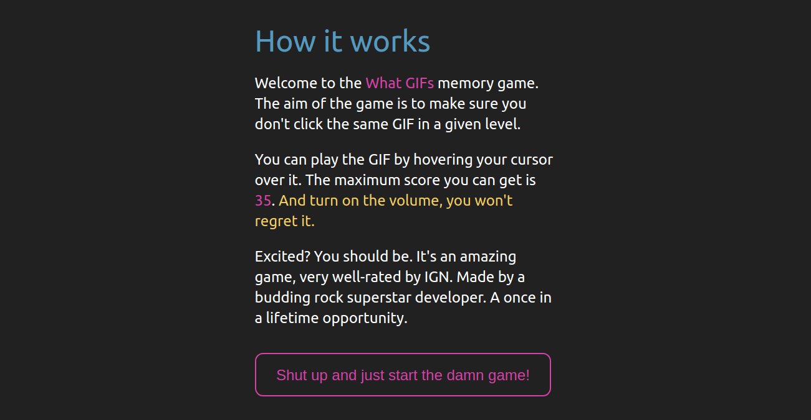
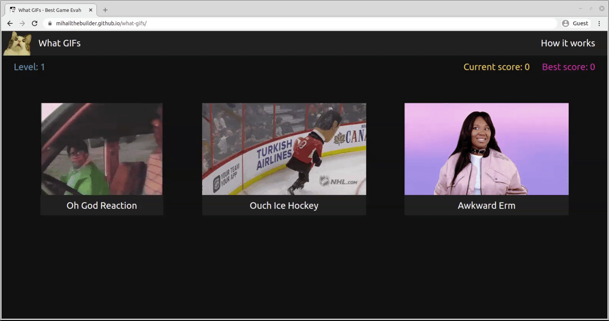
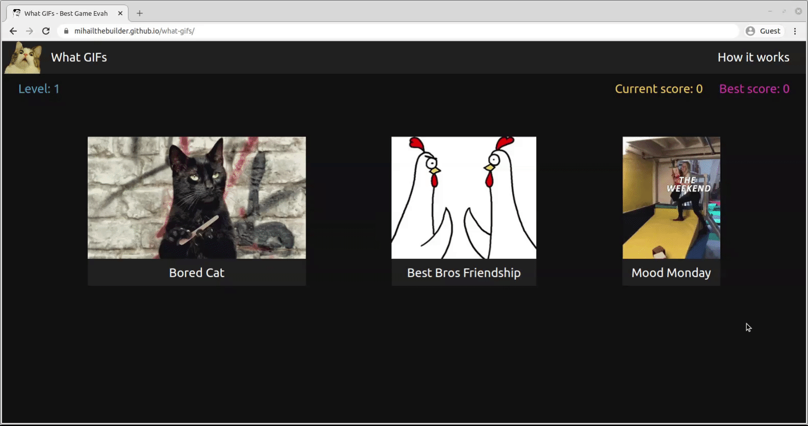
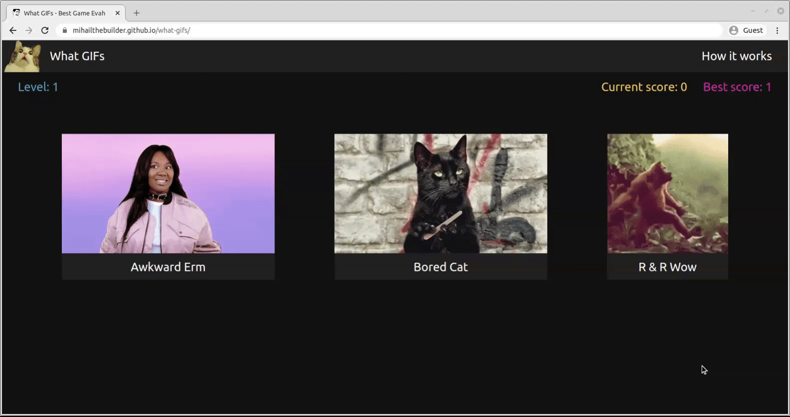

## Table of Contents

- [Overview](#overview)
- [How it works](#how-it-works)
- [Technical details](#technical-details)
  - [State management](#state-management)
  - [Component Setup](#component-setup)
  - [GIF loading](#gif-loading)
  - [Responsive design](#responsive-design)

# Overview

Built with React Hooks, What GIFs is a multi-level memory game where you have to avoid picking the same GIF in a given level. [Live demo](https://mihailthebuilder.github.io/what-gifs/)

**Note:** It's my magnum opus. And don't forget to turn on the volume.

# How it works

The game starts with a full-screen pop-up modal that shows the instructions of the game.



When you click to start the game, a loading GIF gets shown first, then 3 GIFs appear on the screen.


When the screen width is smaller than 1366px, as is the case in the image above, all the GIFs play continuously as soon as they are rendered. For screen widths greater than 1366px, the GIFs only start playing when the cursor is hovered over the element.


The game has 5 levels. In each level, you are given a list of GIFs and you have to avoid picking the same GIF in that level. When you pick correctly, your score increments by 1 and a funny sound is played. The GIFs are then temporarily hidden and their order reshuffled to make it harder to remember which ones you already selected.



Once you get all the cards right in a given level, a loading screen gets shown for a few seconds and you advance to the next level.


If you pick the same card twice in a single level, another funny sound is played and a pop-up appears saying that you lost the game and showing the score you managed to achieve. If this score is better than your best score, the latter will take the value of the former at the start of the next game.



There is a maximum score threshold which, once reached, triggers a pop-up stating that you've won the game together with a 3rd funny sound. You can then choose to re-start the game, with your best score becoming that maximum score.

_This is the part where I'd usually demo the feature, but I refuse to do it this time to convince you to complete the game...or to figure it out from the codebase ;)_

During the game, you can access the instructions shown at the start by clicking the "How it works" button on the top right corner of the screen.



# Technical details

## State management

The game is built using React Hooks, with all states being managed in [App.js](./src/App.js). I avoided applying `useEffect` in here because none of the state changes trigger a standard response. A good example can be found in the `checkAnswer` function, also in [App.js](./src/App.js), which checks whether the GIF selected is a correct answer:

```js
//checks whether we've clicked on a valid card
const checkAnswer = (event) => {
  let cardId = event.target.closest(".card-wrapper").id;

  //hide the cards after the answer was picked
  setCardsVisible(false);

  // Start checking the answer
  if (selectedCards.includes(cardId)) {
    //scenario 1 - incorrect card picked (code not shown)
  } else if (currentScore === MAX_SCORE - 1) {
    //scenario 2 - correct card picked and max score reached (code not shown)
  } else {
    //scenario 3) correct card picked and max score not reached
    playSound(RightAnswerSound);

    //if the higher score -> next level
    if (scoreToLevel(currentScore + 1, levelToCardNum) > level) {
      //increment the level
      setLevel((previousValue) => previousValue + 1);
      //clear the selected cards from memory
      setSelectedCards([]);
      //show the level loading screen
      setLevelLoadingVisible(true);

      //after a set time...
      setTimeout(() => {
        //hide the loading screen
        setLevelLoadingVisible(false);
        //pick the cards for that level
        setCurrentCards(pickCards(levelToCardNum(level + 1), CARD_DECK));
        //show the cards
        setCardsVisible(true);
      }, LEVEL_LOAD_TIME);

      // if the level doesn't increase
    } else {
      //add the selected card to memory
      setSelectedCards((previousArray) => previousArray.concat(cardId));
      //shuffle the cards
      setCurrentCards((previousCards) => shuffleCards(previousCards));
      //show the cards
      setTimeout(() => setCardsVisible(true), 200);
    }
    //increment the score
    setCurrentScore((previousScore) => previousScore + 1);
  }
};
```

You can see that the same change in the `currentScore` state - an increment of 1 - can lead to totally different state changes.

## Component Setup

The web app features 4 components:

1. [PopUp](./src/components/PopUp) - a pop-up modal that is rendered...

   1. At the start of the game.
   2. When an incorrect answer is picked.
   3. At the end of the game.
   4. When the user clicks the "How it works" button on the top right side of the screen.

2. [NavBar](./src/components/NavBar) - a nav bar that contains the "How it works" button
3. [GifContainer](./src/components/GifContainer) - the wrapper for an individual GIF together with its title
4. [GameData](./src/components/GameData) - a section that renders the current & best score, and the level

## GIF loading

The GIF files have been placed in the [public](./public) folder as they aren't loaded together with the production code. Instead, each GIF is loaded only when it's needed in the game using the [GifContainer](./src/components/GifContainer/index.jsx) component:

```jsx
const GifContainer = ({ source, title, checkAnswer }) => {
  //code...
  return (
    <div className="card-wrapper" id={source} onClick={checkAnswer}>
      {/*image loaded from public folder*/}
      
      <div className="title font-size-regular">{title}</div>
    </div>
  );
};
```

There are 2 sub-folders in [public](./public):

1. [original](./public/original) has the actual GIF files.
2. [images](./public/images) has an image representing the first scene of each GIF. These images are first rendered on desktop screens; it is only when you hover on the image that the GIF is actually played by switching the `src` of the `img` element to the corresponding file in the `original` folder.

```jsx
const GifContainer = ({ source, title, checkAnswer }) => {
  //code...

  //replace static image with GIF
  const playGif = () => {
    //the GIFs are placed in the public folder because they're dynamically loaded one by one, not all at once
    cardWrapper.querySelector(
      "img"
    ).src = `${process.env.PUBLIC_URL}/gifs/original/${source}.gif`;
    cardWrapper.classList.add("yellow-font");
  };

  //replace GIF with static image
  const stopPlayGif = () => {
    cardWrapper.querySelector(
      "img"
    ).src = `${process.env.PUBLIC_URL}/gifs/images/${source}.jpg`;
    cardWrapper.classList.remove("yellow-font");
  };

  //if desktop, only play GIF on hover, otherwise always play it
  if (window.innerWidth > RESPONSIVE_THRESHOLD) {
    cardWrapper.addEventListener("mouseenter", playGif);
    cardWrapper.addEventListener("mouseleave", stopPlayGif);
  } else {
    playGif();
  }
  //code...
};
```

The `CARD_DECK` constant in [common/index.js](./src/common/index.js) holds the following variables required to render the GIF:

1. `source` = a key that indicates the filename; e.g. a key of `"awkward"` corresponds to the `/public/gifs/original/awkward.gif` and `/public/gifs/original/awkward.img` files.
2. `title` = the title of the GIF.

```js
function CardItem(key, title) {
  this.key = key;
  this.title = title;
}

const CARD_DECK = [
  new CardItem("awkward", "Awkward Erm"),
  new CardItem("bored", "Bored Cat"),
  new CardItem("ohgod", "Oh God Reaction"),
  new CardItem("doggystyle", "Doggy Style Fail"),
  new CardItem("rwow", "R & R Wow"),
  new CardItem("failhome", "Fail Home Video"),
  new CardItem("letmein", "Let Me In"),
  new CardItem("icehockey", "Ouch Ice Hockey"),
  new CardItem("bros", "Best Bros Friendship"),
  new CardItem("weekend", "Mood Monday"),
  new CardItem("office", "The Office Get Out"),
];
```

The number of rounds/levels can be easily modified by changing the `levelToCardNum` function in `src/common/index.js`. The app has been built in a way that avoids it being broken by this particular change. You can also add more GIFs and expand the `CARD_DECK` constant to allow for more rounds and levels.

## Responsive design
